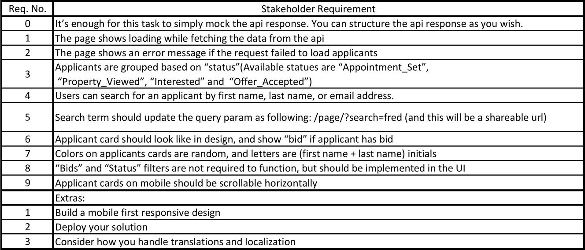
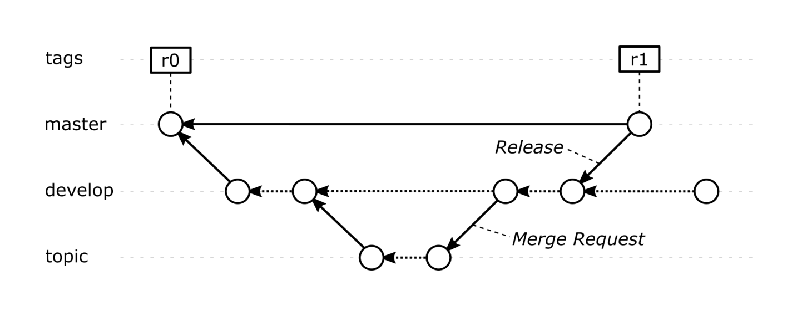

# Cloning the project

If your clone this repository, all you need to do afterwards is execute

`npm run build`

# Reviewing the project

The project is currently deployed on Heroku and can be accessed by the followin link:

[https://applicant-page.herokuapp.com/](https://applicant-page.herokuapp.com/)

# McMakler Applicants Page Project Manual


## Introduction and Purpose

This document represents the assignment given to Ilia Valkov by McMakler as a 
part of the application process for a Frontend Developer position. This 
document is written with the purpose of documenting the lifecycle of the 
development process and giving a detailed overview to the stakeholder.

This document includes the stakeholder requirements and the elicitation of the
software requirements.

This document does not fulfill the task of verification and validation.

## Project Structure

The document consists of the following chapters:

1. Stakeholder needs 
    1. Use case
    1. Design
    1. Tech Stack
1. Software requirements
1. Design and trade-offs
    1. Git branching model
   
### Stakeholder needs 

#### Use case
---

As an owner for a property at McMakler, you are able to list all the applicants to your property, see their
status, and search for specific applicants.

#### Design
---

For the UI design a [figma wireframe](https://www.figma.com/file/BgajmFzDq2h4BwVrVFegBn/mcmakler-applicants-page?node-id=0%3A1) has been supplied.

#### Requirements
---

Must have:

- It’s enough for this task to simply mock the api response. You can structure the api response as you wish.
- The page shows loading while fetching the data from the api
- The page shows an error message if the request failed to load applicants
-  Applicants are grouped based on “status”
    - Available statues are “Appointment_Set”, “Property_Viewed”, “Interested” and “Offer_Accepted”
- Users can search for an applicant by first name, last name, or email address.
- Search term should update the query param as following 
    - /page/?search=fred (and this will be a shareable url)
- Applicant card should look like in design, and show “bid” if applicant has bid
- Colors on applicants cards are random, and letters are (first name + last name) initials
- “Bids” and “Status” filters are not required to function, but should be implemented in the UI
- Applicant cards on mobile should be scrollable horizontally

Nice to have: 

- Build a mobile first responsive design
- Deploy your solution
- Consider how you handle translations and localization

#### Tech Stack
---

For the task at hand, the following tools are to be used: 

- React
- Typescript
- npm
- webpack 

### Software requirements
The stakeholder specified the following requirements:



From them have been extraxted the following software requirements:


### Design and trade-offs

Source folder structure rundown: 

```
src/

    code/

        /components

        d.ts

        main.tsx

        mock_api.ts

        state.ts

    css/

    media/

    index.html
```

Worth explaining is the state.ts file. It exports a function that returns the applications state object, containing all fields and manipulation methods.
This enables the passing of state to the topmost component of the Application, which in turn passes the needed information to its children components.
This is done in order to abstract the application logic from its' components. This approach is showcased in "Modern Full-Stack Development" by Frank Zammetti (Apress, 2020).


#### Git branching model
---


This project adopts a simplified version of the
“Gitflow” workflow, without using “hotfix” and “release” branches.
Topic branches are used in their place.
A topic falls into the categories:

- feature,
- fix,
- doc, or
- misc.

The categories are used as prefixes for any new branch.
To differentiate different branches, a slash ("/") character is put between the
category and the branch name (example: doc/project-manual).
The persistent branches used in the workflow are depicted in the image below.


- The "master" branch holds release versions.
- The "development" branch serves as the main working branch.
- "Topic" branches are created as needed.

They are created from the "development" branch, and used to facilitate the
development of a particular topic in the source code.

